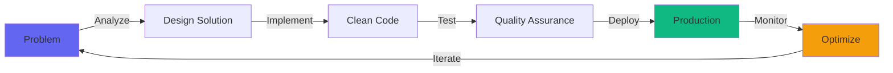

<h1 align="center">
  
</h1>

<p align="center">
  
</p>

<p align="center">
  <a href="https://github.com/alfinasinaja">
    
  </a>
  
  <a href="https://github.com/alfinasinaja?tab=repositories">
    
  </a>
</p>

---


### 👨‍💻 About Me

I'm a passionate **Full Stack Developer** from Indonesia, specializing in building robust and scalable web applications. I love turning complex problems into simple, beautiful, and intuitive solutions.

```typescript
const alfinas = {
    pronouns: "He" | "Him",
    location: "🇮🇩 Cikarang, West Java, Indonesia",
    role: "Full Stack Developer",
    workingOn: "Cloud-native microservices",
    
    techStack: {
        backend: ["NestJS", "Express.js", "Laravel"],
        frontend: ["React", "Next.js", "TypeScript"],
        devops: ["Kubernetes", "Docker", "CI/CD"],
        databases: ["PostgreSQL", "MongoDB", "Redis"],
        languages: ["TypeScript", "JavaScript", "PHP", "Python"]
    },
    
    architecture: [
        "Microservices",
        "Event-Driven",
        "Serverless",
        "REST & GraphQL APIs"
    ],
    
    currentFocus: [
        "Advanced K8s Orchestration",
        "System Design Patterns",
        "Performance Optimization",
        "Clean Architecture"
    ],
    
    lifePhilosophy: "Code is poetry, bugs are just plot twists"
};
```

<br clear="right"/>

---

## 🛠️ Tech Stack & Tools

<div align="center">

### ⚙️ Backend Development
<p>
  
  
  
  
  
  
</p>

### 🎨 Frontend Development
<p>
  
  
  
  
  
  
</p>

### ☁️ Cloud & DevOps
<p>
  
  
  
  
  
  
</p>

### 🗄️ Databases & Cache
<p>
  
  
  
  
  
</p>

### 🔧 Development Tools
<p>
  
  
  
  
  
</p>

</div>

---

## 📊 GitHub Statistics

<p align="center">
  
  
</p>

<p align="center">
  
</p>

<details>
<summary><b>📈 Detailed Activity Graph</b></summary>
<br>
<p align="center">
  
</p>
</details>

---

## 🏆 GitHub Achievements

<p align="center">
  
</p>

---

## 🔥 What I'm Currently Working On

<table>
  <tr>
    <td valign="top" width="50%">

### 🚀 Professional Projects
      
```yaml
microservices_platform:
  description: "Building scalable microservices with NestJS"
  tech: [NestJS, Kubernetes, Docker, PostgreSQL]
  status: "In Progress"
  
e_commerce_api:
  description: "High-performance REST API"
  tech: [Express.js, MongoDB, Redis, JWT]
  status: "Production Ready"
  
admin_dashboard:
  description: "Modern admin panel with real-time data"
  tech: [Next.js 14, React, Tailwind CSS]
  status: "Active Development"
```

</td>
<td valign="top" width="50%">

### 📚 Learning & Exploring

```yaml
currently_learning:
  - Advanced Kubernetes patterns & Helm
  - System Design & Scalability
  - Event-Driven Architecture
  - CQRS & Event Sourcing
  - gRPC & Microservices Communication
  - Performance Optimization Techniques
  
next_on_list:
  - Service Mesh with Istio
  - Observability with OpenTelemetry
  - GraphQL Federation
  - Rust Programming
```

</td>
  </tr>
</table>

---

## 💡 Core Competencies

<div align="center">

| Domain | Skills | Proficiency |
|--------|--------|-------------|
| **Backend** | NestJS, Express, Laravel, REST APIs, GraphQL | ████████████ 95% |
| **Frontend** | React, Next.js, TypeScript, Modern CSS | ███████████░ 92% |
| **DevOps** | Kubernetes, Docker, CI/CD, Infrastructure as Code | ██████████░░ 85% |
| **Database** | PostgreSQL, MongoDB, Redis, Query Optimization | ███████████░ 90% |
| **Architecture** | Microservices, Clean Code, Design Patterns | ██████████░░ 88% |

</div>

---

## 🎯 Professional Highlights

<div align="center">



</div>

<table align="center">
  <tr>
    <td align="center" width="25%">
      <br>
      <b>Architecture Design</b><br>
      Building scalable systems
    </td>
    <td align="center" width="25%">
      <br>
      <b>Clean Code</b><br>
      Maintainable & testable
    </td>
    <td align="center" width="25%">
      <br>
      <b>Performance</b><br>
      Optimized solutions
    </td>
    <td align="center" width="25%">
      <br>
      <b>Collaboration</b><br>
      Team player mindset
    </td>
  </tr>
</table>

---

## 📫 Let's Connect & Collaborate

<div align="center">

### 💬 I'm always open to interesting conversations and collaboration opportunities!

<p>
  <a href="mailto:your.email@example.com">
    
  </a>
  <a href="https://linkedin.com/in/alfinasinaja">
    
  </a>
  <a href="https://twitter.com/alfinasinaja">
    
  </a>
  <a href="https://instagram.com/alfinasinaja">
    
  </a>
  <a href="https://your-portfolio.com">
    
  </a>
  <a href="https://dev.to/alfinasinaja">
    
  </a>
</p>

### 📧 **Email:** your.email@example.com
### 🌐 **Portfolio:** [alfinas.dev](https://your-portfolio.com)

</div>

---

<details>
<summary><b>⚡ Recent Activity</b></summary>
<br>

<!--START_SECTION:activity-->
<!--END_SECTION:activity-->

</details>

<details>
<summary><b>📝 Latest Blog Posts</b></summary>
<br>

<!-- BLOG-POST-LIST:START -->
<!-- BLOG-POST-LIST:END -->

</details>

---

<p align="center">
  
</p>

<div align="center">
  
### 💼 Open for freelance projects and collaboration opportunities

**"Clean code always looks like it was written by someone who cares."** - Robert C. Martin


</div>
